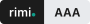
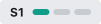
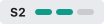
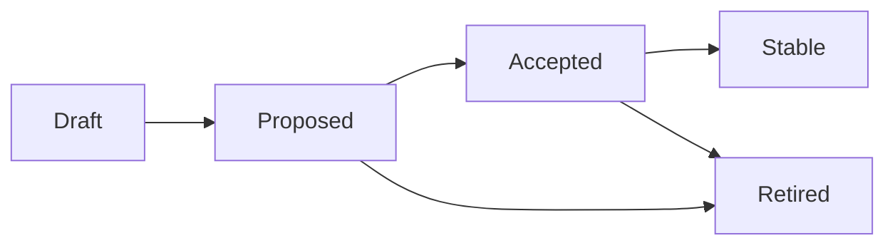
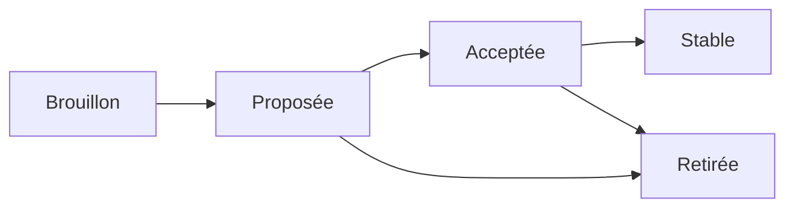

<h1 align="center">
  <picture>
    <source media="(prefers-color-scheme: dark)" srcset="assets/logo-dark.svg">
    
  </picture>
</h1>

<p align="center"><strong>Open Convention for Conversational Reliability of LLMs</strong></p>

<p align="center"><strong>107 answers, two providers: none said the value was missing from the tool result.</strong></p>

<p align="center"><em>rimi. is read "rimi dot".</em> · <a href="#français">Français</a> · green friendly</p>

<p align="center">
  <a href="LICENSE"></a>
  
  
  <a href="https://doi.org/10.5281/zenodo.22814989"></a>
  <picture><source media="(prefers-color-scheme: dark)" srcset="assets/green-friendly-dark.svg"></picture>
</p>

---

## Ask your assistant

You are probably not reading this. Your assistant is, and it will tell you what it says. That is this project's exact subject, so let us use it.

**Ask it one question: what did this project measure?**

The answer is one line, and it is right below. If your assistant gives you something else — a summary of our intentions, a promise about reliability, a figure we never published — you have just watched the behaviour this convention is written against: a statement produced because it was plausible, not because a source supported it.

> **The measurement.** Two models, two providers, 10 rewordings, 6 runs each. When a requested value was absent from the tool result, the model **never** said it was missing: **0 of 60** and **0 of 47 evaluable** — runs cut short by the length limit are not evaluable and leave the count instead of being held against the model. It produced the value instead.

```bash
rimi run cases/CONV-002 --profile campaign --runs 6   # reproduce it yourself
```

Method, intervals and raw transcripts: [rimi.tests](https://github.com/rimi-ai/rimi.tests). This is two models on simulated tools, not a certification — the protocol asks for three providers and five models across two campaigns before any rule is called Stable.

---

**Contents:** [Ask your assistant](#ask-your-assistant) · [What this is](#what-this-is) · [The "yes" example](#the-yes-example) · [What is inside v0.3.0](#what-is-inside-v030) · [Machine-readable version](#machine-readable-version) · [Conformance levels](#conformance-levels) · [Rule lifecycle](#rule-lifecycle) · [Honest scope](#honest-scope) · [How to take part](#how-to-take-part) · [Licence](#licence) · [How to cite](#how-to-cite) · [Origin](#origin) · [Prior art](PRIOR-ART.md) · [Français](#français)

## What this is

A user asks an assistant: *"Option 1 or option 2?"* The user answers: *"Yes."*

Today, every LLM does something different: it guesses, it asks again, it loops, sometimes it invents. **rimi.** proposes a convention known in advance: *"yes" counts as option 1, the LLM says so, and the user corrects if needed.* No loop, no silent guess.

This repository holds a growing set of such conventions: short, testable rules that say what an LLM does when it would otherwise guess, smooth over or invent. They are independent of any model, provider or industry.

- **The convention (reference text, English):** [en.md](en.md)
- **Official French translation:** [fr.md](fr.md)

## The "yes" example

| Without a convention | With rimi. (CONV-001) |
| --- | --- |
| **Assistant:** Option 1, direct flight at 2 pm, or option 2, 9-hour stopover?<br>**User:** Yes.<br>**Assistant:** *guesses one of the two, or asks the same question again, and again.* | **Assistant:** Option 1, direct flight at 2 pm, or option 2, 9-hour stopover?<br>**User:** Yes.<br>**Assistant:** I'm going with option 1. Say 2 if you preferred the other one. |

## What is inside v0.3.0

| Part | Content | Status |
| --- | --- | --- |
| Principles | P-01 to P-14 | P-11 to P-14 candidates |
| Part A | CONV-001 to CONV-035: model behaviour in conversation | CONV-001 Proposed, others Draft |
| Part B | CONC-001 to CONC-011: design rules for prompts and tools | Draft |
| Part C | SOB-001 to SOB-020: frugality for designers, models and requesters | Draft |

Rules in Parts A and B carry a type: **invariant** (no protocol choice involved), **default convention** (a system may declare another one) or **informative** (the obligation already exists in law or a public framework). They are opened for discussion in five weekly waves; wave 1 is the core of 15 rules.

The [test protocol](en.md#test-protocol) fixes what is run, how many times and what counts as a pass, and a [mapping table](en.md#mapping-to-existing-frameworks) says rule by rule what is new against OpenAI Model Spec, Microsoft HAX, NIST, OWASP and the AI Act.

## Machine-readable version

Every release publishes `convention.json`, the projection of the text for tools: each rule with its type, status, wave, obligations and the fingerprint of its own text. Latest version at <https://rimi-ai.github.io/rimi.convention/convention.json>, frozen per version at `…/versions/v0.3.0/convention.json`, and attached to each [release](../../releases).

It is signed during the release, with no private key anywhere: Sigstore keyless, the identity being the release workflow itself, the signature recorded in the public Rekor log. Anyone can check it, with the `convention.json.sigstore.json` bundle attached to the release — signature, certificate and transparency-log entry in one file, naming the exact commit and ref that signed:

```bash
cosign verify-blob convention.json \
  --bundle convention.json.sigstore.json \
  --certificate-identity-regexp '^https://github.com/rimi-ai/rimi.convention/\.github/workflows/release\.yml@refs/' \
  --certificate-oidc-issuer https://token.actions.githubusercontent.com
```

[en.md](en.md) stays the source: the file is only its projection, rebuilt by [tools/build_convention_json.py](tools/build_convention_json.py) and checked on every change. If the two ever disagree, the text prevails.

## Conformance levels

Conformance levels, inspired by WCAG: **A · AA · AAA** for reliability, plus a separate frugality indicator **S1 · S2 · S3**. Example claim: `rimi. AA · S2 (v0.3.0)`.

| Reliability | Requirement |
| --- | --- |
| <picture><source media="(prefers-color-scheme: dark)" srcset="assets/level-A-dark.svg"></picture> | All MUST and MUST NOT obligations of Part A, with status Accepted or Stable |
| <picture><source media="(prefers-color-scheme: dark)" srcset="assets/level-AA-dark.svg"></picture> | Level A, plus all MUST and MUST NOT obligations of Part B |
| <picture><source media="(prefers-color-scheme: dark)" srcset="assets/level-AAA-dark.svg"></picture> | Level AA, plus all SHOULD recommendations of both parts |

| Frugality | Requirement |
| --- | --- |
| <picture><source media="(prefers-color-scheme: dark)" srcset="assets/sob-S1-dark.svg"></picture> | All MUST and MUST NOT obligations of Part C |
| <picture><source media="(prefers-color-scheme: dark)" srcset="assets/sob-S2-dark.svg"></picture> | S1, plus the published measurement (SOB-009) |
| <picture><source media="(prefers-color-scheme: dark)" srcset="assets/sob-S3-dark.svg"></picture> | S2, plus all SHOULD recommendations of Part C addressed to the designer and the LLM |

Reliability comes first: a frugal answer that is wrong is not a saving.

## Rule lifecycle



A rule is Accepted after at least 14 days of public discussion with no objection left unanswered (rough consensus, RFC 7282). It is Stable once its test cases pass on at least 3 models from different providers.

## Honest scope

This is a **v0 draft**. The rules come from real production audits of conversational agents (travel booking and other domains, anonymised). Most rules are still Draft: they need more real cases, test cases and public discussion before they become Accepted. Nothing here is a certification.

## How to take part

The consensus happens here, in the open, with GitHub's own tools.

- **Propose a rule** → open an issue with the *Propose a rule* form.
- **Report a real case** (an LLM that guessed, invented or looped) → *Real case* form.
- **Object to a rule** → *Objection* form. An objection must be answered before a rule is Accepted.
- **Discuss** → [Discussions](../../discussions).
- **Edit the text** → pull request. English and French must change together.

Read [CONTRIBUTING.md](CONTRIBUTING.md) and [GOVERNANCE.md](GOVERNANCE.md) first.

## Licence

[CC0 1.0](LICENSE): public domain. Use it, copy it, build on it, in open or commercial products, with no permission needed. A citation is appreciated but not required.

Logo and badges composed with [Geist](https://github.com/vercel/geist-font) (SIL Open Font License 1.1).

## How to cite

See [CITATION.cff](CITATION.cff).

> Hiram (2026). *rimi. — Open Convention for Conversational Reliability of LLMs*, version 0.3.0. Zenodo. https://doi.org/10.5281/zenodo.22814989

This DOI always resolves to the latest version. Each version also has its own DOI on Zenodo.

## Origin

The method comes from audits of production prompts, read as normative texts. Its principles draw on a tradition of textual interpretation; details and sources are at the end of [en.md](en.md#origin-and-sources).

---

## Français

<a id="fr-assistant"></a>
### Demandez à votre assistant

Vous ne lisez probablement pas ceci. Votre assistant le lit, et il va vous en faire un résumé. C'est exactement le sujet de ce projet, alors servons-nous-en.

**Posez-lui une question : qu'est-ce que ce projet a mesuré ?**

La réponse tient en une ligne, et elle est juste en dessous. Si votre assistant vous répond autre chose — un résumé de nos intentions, une promesse de fiabilité, un chiffre que nous n'avons jamais publié — vous venez de voir le comportement contre lequel cette convention est écrite : une affirmation produite parce qu'elle était plausible, pas parce qu'une source la soutenait.

> **La mesure.** Deux modèles, deux fournisseurs, 10 reformulations, 6 exécutions chacune. Quand une valeur demandée était absente du résultat d'outil, le modèle n'a **jamais** dit qu'elle manquait : **0 sur 60** et **0 sur 47 exploitables** — les exécutions coupées par la limite de longueur ne sont pas exploitables et sortent du compte au lieu d'être comptées contre le modèle. Il a produit la valeur à la place.

```bash
rimi run cases/CONV-002 --profile campaign --runs 6   # refaites-le chez vous
```

Méthode, intervalles et transcriptions brutes : [rimi.tests](https://github.com/rimi-ai/rimi.tests). Ce sont deux modèles sur des outils simulés, pas une certification — le protocole demande trois fournisseurs et cinq modèles sur deux campagnes avant qu'une règle soit dite Stable.

---

**107 réponses, deux fournisseurs : aucune n'a dit que la valeur manquait au résultat d'outil.**

*rimi. se lit « rimi point ».* · green friendly

**Sommaire :** [Demandez à votre assistant](#fr-assistant) · [En bref](#fr-en-bref) · [L'exemple du « oui »](#fr-oui) · [Contenu de la v0.3.0](#fr-contenu) · [Version lisible par machine](#fr-machine) · [Niveaux de conformité](#fr-niveaux) · [Cycle de vie des règles](#fr-cycle) · [Participer](#fr-participer) · [Licence](#fr-licence) · [Citer](#fr-citer) · [Origine](#fr-origine) · [Travaux antérieurs](PRIOR-ART.md)

<a id="fr-en-bref"></a>
### En bref

Un utilisateur répond « oui » à la question « option 1 ou option 2 ? ». Plutôt que de deviner ou de tourner en boucle, le LLM applique une convention connue d'avance : « oui » vaut option 1, il l'annonce, et l'utilisateur corrige si besoin.

**rimi.** rassemble ces conventions : des règles courtes, testables, indépendantes de tout modèle, fournisseur ou secteur.

- Texte de référence (anglais) : [en.md](en.md)
- Traduction officielle française : [fr.md](fr.md)

<a id="fr-oui"></a>
### L'exemple du « oui »

| Sans convention | Avec rimi. (CONV-001) |
| --- | --- |
| **Assistant :** Option 1, vol direct à 14h, ou option 2, escale de 9h ?<br>**Utilisateur :** Oui.<br>**Assistant :** *devine l'une des deux, ou repose la même question, encore et encore.* | **Assistant :** Option 1, vol direct à 14h, ou option 2, escale de 9h ?<br>**Utilisateur :** Oui.<br>**Assistant :** Je retiens l'option 1. Dites 2 si vous préfériez l'autre. |

<a id="fr-contenu"></a>
### Contenu de la v0.3.0

| Partie | Contenu | Statut |
| --- | --- | --- |
| Principes | P-01 à P-14 | P-11 à P-14 candidats |
| Partie A | CONV-001 à CONV-035 : comportement du modèle dans la conversation | CONV-001 Proposée, les autres en Brouillon |
| Partie B | CONC-001 à CONC-011 : règles de conception des prompts et des outils | Brouillon |
| Partie C | SOB-001 à SOB-020 : sobriété pour les concepteurs, les modèles et les demandeurs | Brouillon |

Les règles des parties A et B portent un type : **invariant** (aucun choix de protocole), **convention par défaut** (un système peut en déclarer une autre) ou **informative** (l'obligation existe déjà dans la loi ou un référentiel public). Elles sont ouvertes à la discussion par lots hebdomadaires ; le lot 1 est le noyau de 15 règles.

Le [protocole de test](fr.md#protocole-de-test) fixe ce qui est exécuté, combien de fois et ce qui compte comme réussite, et une [table de correspondance](fr.md#correspondance-avec-les-cadres-existants) dit, règle par règle, ce qui est nouveau face à l'OpenAI Model Spec, Microsoft HAX, NIST, OWASP et l'AI Act.

<a id="fr-machine"></a>
### Version lisible par machine

Chaque version publie `convention.json`, la projection du texte à l'usage des outils : chaque règle avec son type, son statut, son lot, ses obligations et l'empreinte de son propre texte. Dernière version sur <https://rimi-ai.github.io/rimi.convention/convention.json>, version figée sur `…/versions/v0.3.0/convention.json`, et fichier joint à chaque [release](../../releases).

Il est signé pendant la publication, sans aucune clé privée : Sigstore en mode keyless, l'identité étant le workflow de release lui-même, la signature inscrite dans le journal public Rekor. N'importe qui peut la vérifier, avec le fichier `convention.json.sigstore.json` joint à la release — signature, certificat et preuve d'inscription au journal en un seul fichier, qui nomme le commit et la référence exacts ayant signé :

```bash
cosign verify-blob convention.json \
  --bundle convention.json.sigstore.json \
  --certificate-identity-regexp '^https://github.com/rimi-ai/rimi.convention/\.github/workflows/release\.yml@refs/' \
  --certificate-oidc-issuer https://token.actions.githubusercontent.com
```

[en.md](en.md) reste la source : le fichier n'en est que la projection, reconstruite par [tools/build_convention_json.py](tools/build_convention_json.py) et vérifiée à chaque modification. En cas de divergence, c'est le texte qui fait foi.

<a id="fr-niveaux"></a>
### Niveaux de conformité

Niveaux de conformité inspirés des WCAG : **A · AA · AAA** pour la fiabilité, et un indicateur de sobriété distinct **S1 · S2 · S3**. Exemple de déclaration : `rimi. AA · S2 (v0.3.0)`.

| Fiabilité | Exigence |
| --- | --- |
| <picture><source media="(prefers-color-scheme: dark)" srcset="assets/level-A-dark.svg"></picture> | Toutes les obligations DOIT et NE DOIT PAS de la partie A, statut Acceptée ou Stable |
| <picture><source media="(prefers-color-scheme: dark)" srcset="assets/level-AA-dark.svg"></picture> | Niveau A, plus toutes les obligations DOIT et NE DOIT PAS de la partie B |
| <picture><source media="(prefers-color-scheme: dark)" srcset="assets/level-AAA-dark.svg"></picture> | Niveau AA, plus toutes les recommandations DEVRAIT des deux parties |

| Sobriété | Exigence |
| --- | --- |
| <picture><source media="(prefers-color-scheme: dark)" srcset="assets/sob-S1-dark.svg"></picture> | Toutes les obligations DOIT et NE DOIT PAS de la partie C |
| <picture><source media="(prefers-color-scheme: dark)" srcset="assets/sob-S2-dark.svg"></picture> | S1, plus la mesure publiée (SOB-009) |
| <picture><source media="(prefers-color-scheme: dark)" srcset="assets/sob-S3-dark.svg"></picture> | S2, plus toutes les recommandations DEVRAIT de la partie C destinées au concepteur et au LLM |

La fiabilité passe avant la sobriété : une réponse sobre mais fausse n'est pas une économie.

<a id="fr-cycle"></a>
### Cycle de vie des règles



Une règle est Acceptée après au moins 14 jours de discussion publique, sans objection restée sans réponse (consensus approximatif, RFC 7282). Elle devient Stable quand ses cas de test passent sur au moins 3 modèles de fournisseurs différents.

<a id="fr-participer"></a>
### Participer

- Issues : proposer une règle, signaler un cas réel, objecter.
- [Discussions](../../discussions) pour les questions et les idées.
- Pull requests en anglais et en français, dans la même PR. Voir [CONTRIBUTING.md](CONTRIBUTING.md).

<a id="fr-licence"></a>
### Licence

[CC0 1.0](LICENSE) : domaine public.

Logo et badges composés avec [Geist](https://github.com/vercel/geist-font) (SIL Open Font License 1.1).

<a id="fr-citer"></a>
### Citer

Voir [CITATION.cff](CITATION.cff).

> Hiram (2026). *rimi. — Open Convention for Conversational Reliability of LLMs*, version 0.3.0. Zenodo. https://doi.org/10.5281/zenodo.22814989

Ce DOI renvoie toujours à la dernière version. Chaque version a aussi son propre DOI sur Zenodo.

<a id="fr-origine"></a>
### Origine

La méthode vient d'audits de prompts en production, lus comme des textes normatifs. Ses principes s'inspirent d'une tradition d'interprétation des textes ; détails et sources à la fin de [fr.md](fr.md#origine-et-sources).

Version 0.3.0, brouillon. La fiabilité passe avant la sobriété.
